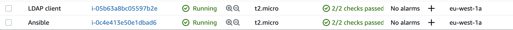
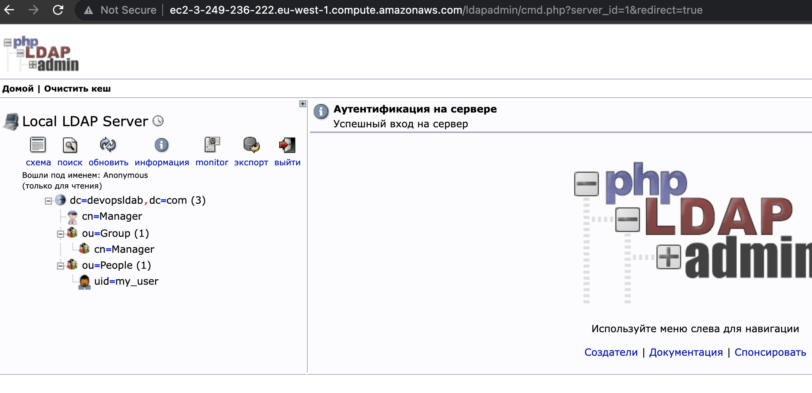
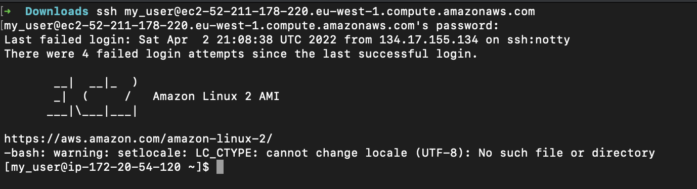

# HOMETASK REQUIREMENTS 

1. ###### GCP account configured 

   

2. ###### SH – scripts for installation/configuring of the necessary applications

   

3. ###### Screenshots of the application’s state 

   